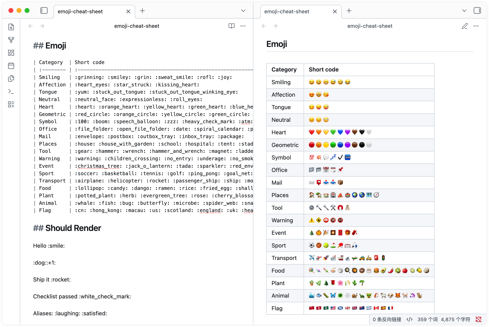
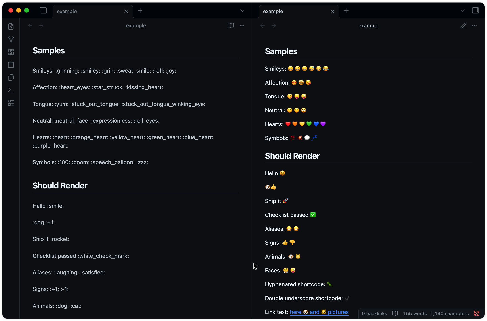

# Gemoji for Obsidian

> English | [简体中文](https://github.com/tofrankie/obsidian-plugin-gemoji/blob/main/README.zh_CN.md)

**Gemoji** (GitHub Emoji) renders emoji shortcodes in Obsidian Reading mode.

## Features

- Render supported shortcodes such as `:smile:` 😄, `:rocket:` 🚀, `:+1:` 👍, and `:white_check_mark:` ✅ as Unicode emoji.
- Preserve markdown source content.

## Preview

Screenshots

## Scope

This plugin targets Obsidian Reading mode and markdown rendering contexts supported by Obsidian markdown post processors. It does not currently render emoji shortcodes in Live Preview or Source mode.

## How to Install

This plugin is available in the Obsidian Community Plugins [store](https://community.obsidian.md/plugins/gemoji).

Manually

1. Download `main.js` and `manifest.json` from the latest GitHub [release](https://github.com/tofrankie/obsidian-plugin-gemoji/releases).
2. Create `/your_vault/.obsidian/plugins/gemoji/`.
3. Place the downloaded files in that folder.
4. In Obsidian, go to Settings -> Community plugins -> Installed plugins -> Gemoji -> Enable, then restart Obsidian.

## Credits ❤️

- [gemoji](https://github.com/wooorm/gemoji) for emoji shortcode data.
- [emoji-cheat-sheet](https://github.com/ikatyang/emoji-cheat-sheet) for the GitHub emoji cheat sheet.

## License

MIT License © [Frankie](https://github.com/tofrankie)
